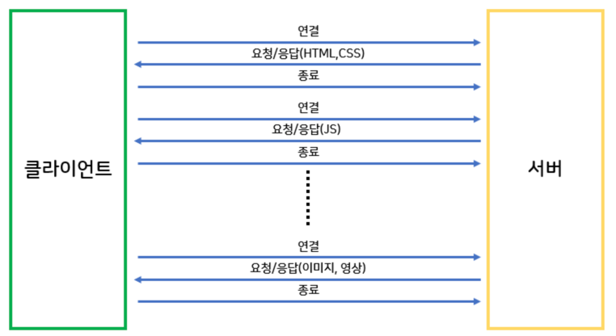
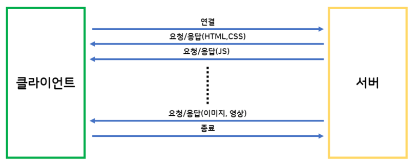

# cs-study

## 스터디 시간 !

화요일 9시  
8월 1,8,22,29(4번), 9월 5,12,19,26(4번) -> 8번 9월 26일 종료

## 스터디 규칙 !

3회 불참시 추방

## 스터디 방식 !

금요일까지 질문 3~5개 각자 올리기 (구글 문서에)  
화요일에 만나면  
주 별 답변 못한 문제를 재응답 (30분)  
(10~20 분 사이 정해두고 3:1 한명에게 질문하기 궁금한것 계속 물어보면서 , 리뷰(5분) ) \* 4 (80분)  
리드미 정리 (30분)

## 각 주차별 계획

1주차 : 네트워크  
2주차 : 네트워크  
3 주차 : 운영체제  
4 주차 : 운영체제  
5 주차 : 자바/스프링/JPA  
6 주차 : 자바/스프링/JPA  
7 주차 : 데이터 베이스  
8 주차 : 알고리즘 / 자료구조

## 참고 사이트

https://github.com/gyoogle/tech-interview-for-developer  
https://github.com/JaeYeopHan/Interview_Question_for_Beginner

## 프로젝트 정리법

가장 도전적이 었던것  
실수, 실패담  
즐거웠던것
리더십
팀원과의 갈등
남들과 다르게 행동했던 것

## 🍀네트워크

Http는 Stateful 한가요?

안녕

- TCP와 UDP의 차이점에 대해서 설명하기
- 웹 브라우저가 웹 사이트를 렌더링 하는 과정에 대해서 설명하기
- Synchronous & Asynchronous와 Blocking & Nonblocking의 차이
- 대칭키, 비대칭키 암호화 방식에 대해 설명
- GET과 POST 차이를 설명
- TCP/IP 프로토콜 4계층 종류와 설명
- IP란 무엇인가? IP의 풀네임 및 정의
- 게이트 웨이란?
- HTTPS 프로토콜이란?
- ARP와 RARP 차이
- OSI7계층 각각의 의미와 순서
- 브라우저에 "www.google.com" 입력하면 어떤일이 일어날까요?
- RESTful API란 무엇인가요?
- CORS는 무엇인가요?
- CSRF는 무엇인가요?
- OSI 7 Layer 또는 TCP/IP Layer에서 계층화하는 이유가 무엇인가요?

 현대 웹 에서는 비연결성을 해결방법을 설명해주세요.

- 비 연결성 : HTTP 요청에 대한 응답을 제공한 후에 연결을 끊는다.
- 비 상태성 : HTTP 요청과 응답하는 동안 상태를 저장하지 않는다.

### HTTP 비지속 연결

서버에서 응답이후에 TCP에게 연결을 끊으라고 요청하고 HTTP클라이언트가 응답메시지를 받으면 TCP 연결이 중단된다.  
(연결이 유지 되지 않는다, 즉 하나의 요청메세지와 하나의 응답메시지에 하나의 연결이다)

### HTTP 지속 연결(Persistent Connections)

HTTP/1.1 부터 Keep-Alive 기능이 추가되어 하나의 TCP연결로 여러개의 요청과 응답을 처리할 수 있다.
일정시간 동안 연결을 유지해서 요청과 응답이 모두 끝날때까지 연결해준다.
keep-alive : 서버의 HTTP요청시, 요청 message 헤더 추가

- 로드 밸런싱이란 무엇인가요
- 프록시에 대해서 설명해주세요

 서브넷 마스크에 대해서 설명해주세요. 

- 서브넷(Subnet) : 전세계에는 다양한 네트워크가 존재하고 있습니다. 이 때 네트워크의 규모가 커질수록 유지보수에는 많이 노력이 필요합니다. 따라서 효율적인 관리를 위해서 네트워크를 더 작은 단위로 나누는 것을 서브넷팅이라고 합니다.

- 서브네팅(Subnetting)의 장점
  - 유지보수의 장점
  - 추가 IP 주소를 할당할 필요가 없음

 매체 접근 제어 (Media Access Control)에 대해서 설명해주세요 

- 하드웨어의 신뢰성 있는 상호작용을 담당하며, 주로 담당하는 전송매체로는 유선, 무선, 광통신 등입니다.

- 두 노드가 동시에 신호를 전달하여, 데이터의 손실이 발생하는 충돌을 예방하기위해 충돌 방지 (Collision Avoidunce) 알고리즘을 적용합니다.

- 또한 특정 MAC 알고리즘은 충돌 이후에 데이터 재전송 기능을 포함하는 경우도 있습니다.

 patch put post의 차이 

### POST(create)

리소스의 생성을 담당한다.  
요청시마다 새로운 리소스를 할당한다.

### PUT(update)

멱등성을 보장한다 (여러번 보내도 같은 리소스를 반환한다)  
리소스의 생성과 수정을 담당한다.  
수정시 전체를 덮어쓴다.

### PATCH(update)

수정만 담당하며 리소스의 일부분만 수정할때 사용한다. (일부만 업데이트)  
PATCH는 멱등하지 않다. 하지만 멱등으로 설계할 수도 있다.

- 3-Handshaking과 4-Handshaking의 과정을 설명해주세요.

TCP/IP 혼잡 제어 기법이 왜 사용되는가?

- 네트워크 혼잡(Network Congestion)이란 네트워크에서 데이터를 노드에게 전달할 수 있는 양보다 더 많은 양을 요청했을 때 발생하는 서비스 품질 저하(QoS)입니다.

- TCP에서는 혼잡 제어 및 회피 기법을 사용해서, 네트워크의 장애를 예방합니다. 이러한 방법으로는 AIMD, SlowStart등의 알고리즘이 존재합니다.

 TCP 연결 설정 과정과 연결 종료 과정의 단계가 다른 이유는 무엇인가? 

연결 과정에서는 연결 과정 수립을 위한 최소한의 설정을 진행한다.  
종료 과정시에는 Client가 데이터 전송을 마쳤다고 하더라도 Server는 아직 보낼 데이터가 남아있을 수 있기 때문에  
일단 FIN에 대한 ACK만 보내고, 데이터를 모두 전송한 후에 자신도 FIN 메시지를 보내는 방식으로 진행되어야 하기 때문이다.

- LAN과 WAN의 차이

Cookie와 Session의 차이

- Cookie는 서버가 브라우저에게 보내는 작은 데이터 단위로, 키-값으로 구성되어 적은 양의 데이터를 저장할 수 있습니다. 이 때 만료 기간등을 설정하여, 데이터 유지기간을 설정할 수 있습니다.
- Session은 서버 내에서 클라이언트의 상태를 저장하는 것으로, 서버 내에서 데이터를 관리하기 때문에, 보안적으로 우수하나 접속한 유저에 대한 세션을 모두 저장해야하기에 성능에 무리가 갈 수 있습니다.

- DNS서버 란?

## 🍀운영체제

 멀티 프로세스 대신 멀티 스레드를 사용하는 이유는? 

- 멀티 프로세스의 경우 Context Switch과, 프로세스 생성 및 소멸, 프로세스간 자원 공유의 어려움이 존재하기에 멀티 스레드를 사용하여 병렬 컴퓨팅 (Parallel Computing)을 구현하기도 합니다.

- 다만 멀티 프로세스의 경우 멀티 스레드에 비해 프로세스간 결합도가 낮기에 안정입니다. 이러한 이유에서 멀티 프로세스를 이용해서 병렬 컴퓨팅을 구현하기도 합니다.

 페이징 기법 알고리즘의 종류와 설명 

- - 페이징(Paging)이란 메모리의 물리적 공간을 추상화하여 페이지(Page)라는 논리적 공간으로 관리하는 메모리 기법을 말합니다.

1. FIFO (First In First Out)
   - 메모리에 가장 오래 있던 페이지를 우선 교체하는 알고리즘 입니다.
2. OPT (Optimal Page Replacement)
   - 앞으로 사용되지 않을 가능성이 높은 페이지를 우선 교체하는 알고리즘 입니다.
3. LRU (Least Recently Used)
   - 가장 오랫동안 사용하지 않은 페이지를 우선 교체하는 알고리즘입니다.
4. LFU (Least Frequently Used)
   - 참조 횟수가 가장 적은 페이지를 우선 교체하는 알고리즘입니다.
5. MFU (Most Frequently Used)
   - 가장 참조 횟수가 많은 페이지를 교체하는 알고리즘입니다.

 스레드에 스택을 독립적으로 할당하는 이유는 무엇일까요 

1. 스레드는 독립적인 실행 단위로써 각각의 함수 호출 및 지역 변수와 반환 주소에 대해서 저장할 필요가 있습니다. 따라서 이러한 정보들을 저장하기 위해서 스택 메모리 공간을 할당합니다.
2. 스레드가 공통된 스택 메모리 공간을 가질 경우, 다른 스레드간의 데이터가 충돌할 가능성이 존재합니다. 다른 스레드가 함수 호출 정보나 반환 주소등을 변경하는 걸 예시로 들 수 있습니다.
3. 스레드가 별도의 스택 메모리 공간을 가질 경우, 컨텍스트 스위칭 (Context Switching)이 효율적으로 이루어집니다. 현재 실행 중인 스레드를 중지해야할 경우 스택에 현재 진행 사항을 저장하고, 이후에 다시 작업을 수행하면 되기 때문입니다. 이러한 맥락으로 프레스간 컨텍스트 스위칭 보다 스레드의 컨텍스트 스위칭이 더 빠른 경향을 보입니다.

오버플로우에 대해 설명해주세요.

- 데이터의 크기가 제한된 용량(지정된 범위)를 벗어나 원치 않거나 예상치 못한 결과를 초래하는 현상이다.  
- 스택 오버플로우가 발생하는 경우 영역의 크기를 늘리거나, 함수에서 사용하는 지역변수의 크기를 줄이는 방법이 있고 아니면 지역변수를 전역 변수로 바꾸면 해결이 가능하다.  
- 스택 오버 플로우의 경우는 지역변수가 저장되는 공간이 스택의 영역이 너무 큰 지역변수를 선언하거나 무한 재귀 호출로 인해 발생할 수 있다. 
- 스택 영역이 힙영역을 침범하는 경우 스택 오버플로우, 힙 영역이 스택영역을 침범하는 경우 힙 오버플로우라 한다. 

  

 

데드락에 대해 설명해주세요.

데드락 이란
- 경쟁상태(raceCondition)에서 서로 lock을 가졌을 때 생길 수 있는 상태
- 모든 작업들이 자원을 얻지 못해 다음 처리를 하지 못하는 상태로 교착상태라고도 이야기한다.
- 프로세스나 스레드 들이 서로 필요한 자원을 한정적으로 서로 가지고 있는경우 발생한다.
- 이런경우 서로 상대방의 자원을 물고 기다리기 때문에 계속해서 서로를 기다리는 형태가 되어 작업을 끝낼 수 없다.

데드락 발생의 조건
- 상호 배제 : 하나의 프로세스만 임계구역을 사용할 수 있도록 다른 프로세스의 접근을 차단하는 것이다.
- 비 선점 : 다른 프로세스에 할당된 자원을 빼앗을 수 없다.
- 점유와 대기 : 하나의 자원을 점유하고 있으며 추가하기전까지 대기 해야한다
- 환형 대기: 원형으로 프로세스들이 얽혀 서로의 프로세스 자원을 요구해야한다.

데드락 해결 방법
- 예방 : 위의 4가지중 하나를 제거하는 방식으로 수행된다.
- 회피 : 교착 상태가 발생하는 경우 적절히 피해가는 방식이다. banker’s algorighm이 사용된다.
- 검출 : 현재의 운영체제에서의 검충 방식 , 시스템에 교착상태가 발생했는지 정검하여 교착상태에 있는 자원을 발견한다.
- 회복 : 교착상태를 일으킨 프로세스를 종료시키거나, 교착상태의 프로세스에 할당된 자원을 선점(preempt)하여 프로세스나 자원을 회복하는 것

  

cpu 스케줄링 기법중 비 선점 방식과 선점 방식의 차이를 말해주세요

선점형 스케줄링(Preemptive Scheduling)
- 한 프로세스가 CPU를 할당받아서 실행하고 있을때 다른 프로세스가 cpu를 사용하고 있는 프로세스를 중지 시키고 cpu를 차지할 수 있는 스케줄링 기법(처리시간 예측이 어렵다)
- 우선순위가 중요하거나 빠른 응답을 요구하는 시분할 시스템에 유리하다
- 컨텍스트 스위치등이 발생하면서 오버헤드가 발생한다.
- Round Robin(RR) ,SRT(Shortest Remaining Time), 선점 우선순위, Multilevel Queue Scheduling  등의 알고리즘이 있다.     

비선점형 스케줄링(Non-preemptive / Cooperative Scheduling) 
- 이미 사용되는 cpu를 빼았지 못하고 사용이 끝날 때 까지 기다리는 스케줄링 기법(처리시간 예측이 용이하다)
- 응답시간예측이 가능하고 일괄처리 방식이 적합하다.
- 중요도가 있는 작업인 경우 사용하기에 좋지 않다.
- FCFS,SJN(Shortest Job Next) ,LJF(Longest Job First), 비 선점 우선순위, Highest Response Ratio Next (HRRN)등이 있다

뮤텍스와 세마포어에 대해서 설명해주세요

세마포어와 뮤텍스는 모두 공유 자원에 대한 동시 접근 문제를 해결하기 위해 사용되는 기술이다. (상호 배제를 달성한다)
+) 이때 공유되는 시스템 자원 부분이 임계 구역이다.

### 세마포어 (Semaphore)
- 세마포어는 공유 자원에 여러 개의 프로세스 또는 스레드가 접근할 때 동시에 접근하는 것을 막기 위해 사용하는 동기화 기술이다. 
- 여러 개의 프로세스나 스레드가 한 번에 공유 자원을 사용하지 않도록 제한할 수 있다 
- 세마포어는 "wait"와 "signal" 두 가지 기능을 가지고 있다 
  - wait(P) : 세마포어 값을 감소시킴, 이 값이 0보다 작아지면 해당 프로세스나 스레드는 대기 상태가 된다(해당 자원을 사용할 수 있을때까지 기다린다, 접근 권한을 기다린다고 표현 가능). 
  - signal(V) : 세마포어 값을 증가시킴(임계 구역에서 나오면서 해당 자원에 들어갈수 있는 자원의 수를 하나 증가시킨다,권한을 반환한다고 표현가능), 대기 중인 프로세스나 스레드 중 하나를 깨워 실행 상태로 만든다
- 장점 
  - 세마포어는 여러 개의 프로세스나 스레드가 동시에 접근 가능하여 자원의 활용도를 높일 수 있다
- 단점 
  - 세마포어가 잘못 사용될 경우, 데드락(deadlock)이 발생할 수 있으므로 신중하게 설계하여야 한다.   

### 뮤텍스 (Mutex)
- 뮤텍스는 하나의 프로세스나 스레드가 공유 자원을 사용하는 동안, 다른 프로세스나 스레드가 접근하지 못하도록 막는 동기화 기술이다.
- 뮤텍스는 적은 수의 스레드만이 자원에 접근하도록 제한할 수 있게 한다
- 뮤텍스는 "lock"과 "unlock" 두 가지 기능을 가지고 있다
  - lock : 뮤텍스를 소유한 스레드는 공유 자원을 사용할 수 있게, 다른 스레드는 대기 상태가 되게 한다
  - unlock : 뮤텍스를 소유한 스레드만이 뮤텍스를 해제할 수 있고, 해제한 후에 다른 스레드가 공유 자원을 사용할 수 있게 한다
- 장점 
  - 뮤텍스는 일반적으로 세마포어보다 간단하게 구현할 수 있다.
- 단점
  - 하나의 스레드만이 뮤텍스를 소유할 수 있다는 단점, 하지만 이를 통해서 데드락을 방지할 수 있다.

추가 설명
- 상호 배제 (Mutual Exclusion) :
  - 상호 배제는 여러 스레드 또는 프로세스가 동시에 공유 자원에 접근하는 것을 막는 개념이다.
  - 이것이 세마포어와 뮤텍스가 사용되는 주요 목적 중 하나이다. 
  - 상호 배제를 통해 경쟁 조건 (Race Condition)을 방지하고 데이터의 일관성을 보장할 수 있다.

### 정리:
- 세마포어 : 현재 공유자원에 접근할 수 있는 스레드,프로세스의 수에 제한을 두어 상호배제를 달성하는 기법
- 뮤텍스 : 한 스레드, 프로세스에 의해 소유될 수 있는 키(key)를 기반으로 하여 상호배제를 달성하는 기법

즉 만약 세마포어의 값이 1개로 제한된다면 뮤텍스와 유사하다. 

폰 노이만 아키텍쳐에 대해서 설명해주세요 

가상메모리란 무엇이고 가상메모리를 어떻게 사용하는지 설명해주세요 

